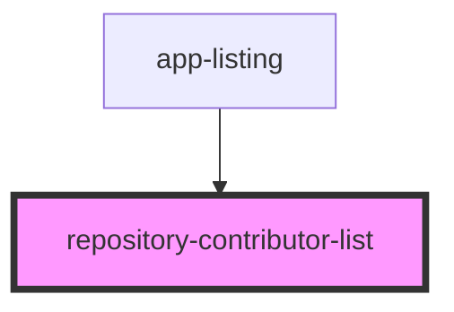

# repository-contributor-list

<!-- Auto Generated Below -->

## Properties

| Property          | Attribute | Description                                                                                                                                                                                                                                                                                                                                                                                                                                                                | Type    | Default |
| ----------------- | --------- | -------------------------------------------------------------------------------------------------------------------------------------------------------------------------------------------------------------------------------------------------------------------------------------------------------------------------------------------------------------------------------------------------------------------------------------------------------------------------- | ------- | ------- |
| `contributorList` | --        | An array of contributors JSON with format returned by Github API. Displaying keys that are considered for this component: [      {          avatar_url: 'http://some-image-url.tld',          login: 'loginname1',          contributions: 10,          url: 'http://somecontriburl.tld'      },      {          avatar_url: 'http://some-image-url-2.tld',          login: 'loginname2',          contributions: 12,          url: 'http://somecontriburl2.tld'      }  ] | `any[]` | `null`  |

## Dependencies

### Used by

 - [app-listing](../app-listing)

### Graph

----------------------------------------------

*Built with [StencilJS](https://stenciljs.com/)*
