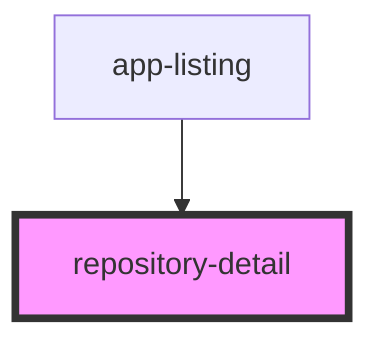

# repository-detail

<!-- Auto Generated Below -->

## Properties

| Property   | Attribute   | Description                                                                                                                                                                                                                                                                                                                                                                                | Type  | Default |
| ---------- | ----------- | ------------------------------------------------------------------------------------------------------------------------------------------------------------------------------------------------------------------------------------------------------------------------------------------------------------------------------------------------------------------------------------------ | ----- | ------- |
| `repoInfo` | `repo-info` | The repository info JSON with this format returned by Github API. Displaying keys that are considered for this component: {      name: 'Repository Name',      description: 'Repository Description'      language: 'English',      license: { name: 'License Name' },      stargazers_count: 345,      homepage: 'http://homepage.tld',      clone_url: 'http://git-clone-url.git.tld'  } | `any` | `null`  |

## Dependencies

### Used by

 - [app-listing](../app-listing)

### Graph

----------------------------------------------

*Built with [StencilJS](https://stenciljs.com/)*
